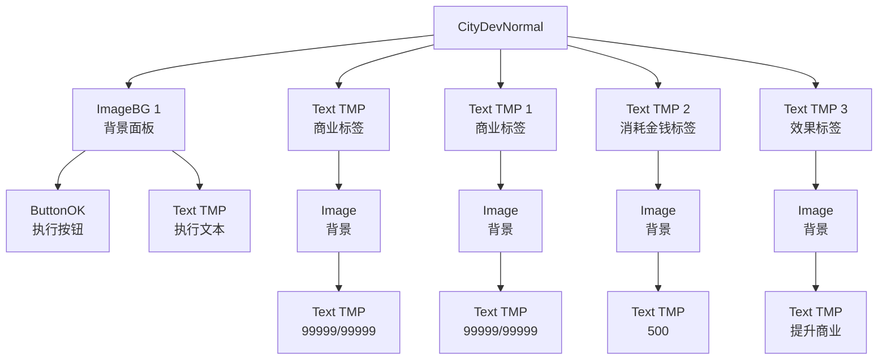

# CityDevNormal 面板布局图

## 层次结构



## 布局示意图

```
+---------------------------------------------------------------+
|                                                               |
|  [商业]          [商业]            [效果]          [消耗金钱]  |
|  [99999/99999]   [99999/99999]     [提升商业]       [500]     |
|                                                               |
|                              +----------------------------+    |
|                              |                            |    |
|                              |          [执行]           |    |
|                              +----------------------------+    |
|                                                               |
+---------------------------------------------------------------+
```

## 详细布局信息

### 根节点
- **名称**: CityDevNormal
- **位置**: 屏幕中心 (0, 0)
- **大小**: 100x100 (基础大小，实际由子元素决定)

### 主要元素

| 元素名称 | 类型 | 位置 | 大小 | 功能 |
|---------|------|------|------|------|
| Text (TMP) | 文本 | (-403, -11.6) | 150x50 | 显示"商业"标签 |
| Text (TMP) (1) | 文本 | (83.96, -11.6) | 150x50 | 显示"商业"标签 |
| Text (TMP) (2) | 文本 | (29.96, -179.6) | 150x50 | 显示"消耗金钱"标签 |
| Text (TMP) (3) | 文本 | (-403.01, -69.6) | 150x50 | 显示"效果"标签 |
| ImageBG (1) | 背景 | (4, -204) | 950x250 | 面板背景 |
| ButtonOK | 按钮 | (-101, -200.6) | 140x50 | 执行按钮 |

### 子元素

| 父元素 | 子元素 | 位置 | 大小 | 功能 |
|-------|--------|------|------|------|
| Text (TMP) | Image | (147, -2.0) | 250x40 | 背景 |
| Image (商业标签) | Text (TMP) | (0, 0) | 220x50 | 显示"99999/99999" |
| Text (TMP) (1) | Image | (147, -2.0) | 250x40 | 背景 |
| Image (商业标签1) | Text (TMP) | (0, 0) | 220x50 | 显示"99999/99999" |
| Text (TMP) (2) | Image | (182, -2.0) | 150x40 | 背景 |
| Image (消耗金钱) | Text (TMP) | (0, 0) | 140x50 | 显示"500" |
| Text (TMP) (3) | Image | (147, -2.0) | 740x40 | 背景 |
| Image (效果) | Text (TMP) | (0, 0) | 700x50 | 显示"提升商业" |
| ImageBG (1) | ButtonOK | (-101, -200.6) | 140x50 | 执行按钮 |
| ButtonOK | Text (TMP) | (0, 0) | 140x50 | 显示"执行" |

## 布局特点

1. **层级结构清晰**：采用父子节点结构，便于管理和定位
2. **响应式布局**：使用RectTransform的锚点系统，确保在不同分辨率下的显示效果
3. **模块化设计**：每个功能区域独立成组，便于维护和扩展
4. **视觉层次分明**：通过位置和大小区分不同功能区域

## 交互流程

1. 用户查看商业属性值和消耗金币
2. 选择参与开发的英雄（通过heroSelect组件）
3. 点击"执行"按钮触发开发操作
4. 系统扣除金币并更新商业属性值

## 优化建议

1. **布局优化**：考虑使用GridLayoutGroup或HorizontalLayoutGroup等布局组件，简化布局管理
2. **资源优化**：合并重复的背景图片资源，减少Draw Call
3. **响应式设计**：增加对不同屏幕尺寸的适配逻辑
4. **视觉反馈**：为按钮添加 hover 和 click 效果，提升用户体验